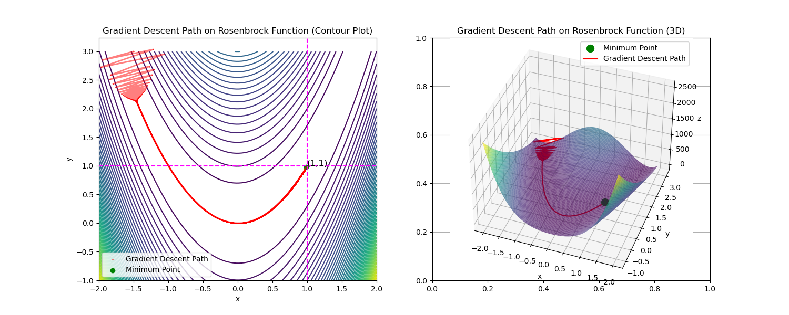

# Rosenbrock Function Optimization

This code is a reproduction of the [whats new in mojo 24_3 blog post](https://github.com/modularml/devrel-extras/blob/main/blogs/whats_new_mojo_24_3/whats_new_mojo_24_3.ipynb), refactored to work as a collection of scripts instead of a Jupyter notebook.

The output of `mojo optimize.mojo` should be something like:

